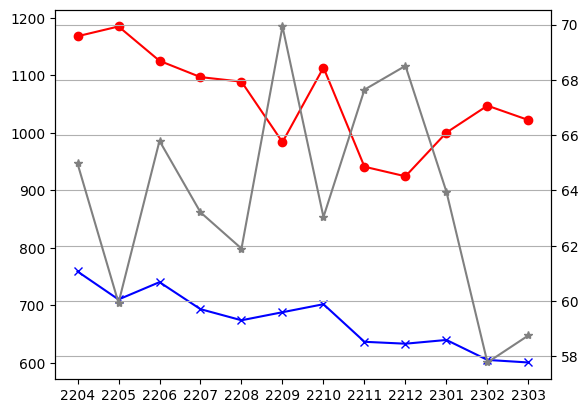

# 부동산 데이터 분석 스크립트

이 스크립트는 주어진 부동산 거래 데이터를 분석하여 매매와 전세 거래의 가격 동향을 시각화하는 파이썬 스크립트입니다.

주요 함수와 그래프 함수로 구성되어 있으며, Matplotlib과 NumPy 라이브러리를 활용하여 데이터 시각화를 수행합니다.

## 사용법

1. 주어진 부동산 거래 데이터를 DataFrame 형태로 준비합니다. 데이터에는 매매와 전세 거래 정보가 포함되어 있어야 합니다.

2. 스크립트를 실행하여 분석 결과를 얻습니다.

## 함수 설명

1. `salesPrice(df1)`: 이 함수는 DataFrame `df1`을 입력으로 받으며, "중개거래" (매매) 거래만 필터링하여 면적 당 가격을 계산하고 월별 평균 가격을 산출합니다.

2. `jeonsePrice(df1)`: 이 함수는 `salesPrice`와 비슷하게 "전세" 거래에 대한 평균 가격을 계산합니다.

3. `showGraph(volumeCountSales, volumeCountJeonse, yymm, salesPpsList, jeonsePpsList, jeonseRateList)`: 이 함수는 매매와 전세 거래의 거래 건수, 년-월 값들의 리스트, 매매 평당 가격 리스트, 전세 평당 가격 리스트, 그리고 전세 비율 리스트를 입력으로 받습니다. 이 함수는 이러한 데이터를 Matplotlib을 이용하여 그래프로 표현합니다.

## 실행

1. 필요한 라이브러리를 불러온 후, 스크립트 내의 `df1`과 `df2`에 분석에 적합한 부동산 거래 데이터가 정의되어 있어야 합니다.

2. `vms, ym, sp = salesPrice(df1)`와 `vmj, ym, jp = jeonsePrice(df2)`와 같은 방식으로 함수를 호출하여 매매와 전세 거래 데이터를 분석합니다.

3. `jr = getJeonseRate(sp, jp)`를 사용하여 매매와 전세 거래의 비율을 계산합니다.

4. `showGraph(vms, vmj, ym, sp, jp, jr)` 함수를 호출하여 분석 결과를 그래프로 시각화합니다.

5. `plt.savefig('부동산그래프.png')`를 사용하여 그래프를 이미지 파일로 저장하고, `plt.show()`를 통해 그래프를 표시합니다.

## 참고

- Google Colab 기반으로 짜여진 파이썬 코드라서 버전이 맞지 않는 문제가 있을 수 있습니다.

- 이 코드는 데이터프레임에 적합한 부동산 거래 데이터가 제공되어야 합니다.데이터가 없거나 형식이 맞지 않으면 실행 오류가 발생할 수 있습니다.

- 그래프가 '부동산그래프.png'라는 이름의 이미지 파일로 저장되며, 필요에 따라 파일 이름을 변경할 수 있습니다.

## 결과 그래프

